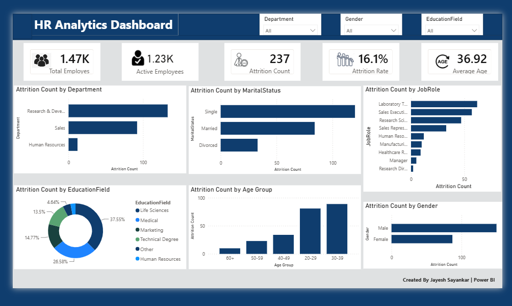

# 📊 HR Analytics Dashboard

A professional HR Analytics Dashboard built in **Power BI** to analyze employee attrition and workforce trends. This project provides actionable insights into employee turnover using interactive visualizations, KPIs, and dynamic filters.

---

## 🚀 Project Overview

This dashboard helps HR teams understand employee attrition patterns by analyzing key workforce metrics such as department, job role, gender, marital status, education field, and age groups. Interactive slicers allow users to filter and explore the data efficiently.

---

## 📌 Key Performance Indicators (KPIs)

- 👥 Total Employees
- ✅ Active Employees
- ❌ Attrition Count
- 📉 Attrition Rate
- 🎂 Average Employee Age

---

## 📈 Dashboard Insights

- Attrition by Department
- Attrition by Job Role
- Attrition by Marital Status
- Attrition by Gender
- Attrition by Education Field
- Attrition by Age Group

---

## 🛠️ Tools & Technologies

- Power BI
- Power Query
- DAX (Data Analysis Expressions)
- Data Modeling
- Data Visualization

---

## 🎯 Features

- Interactive dashboard with slicers
- Clean and professional UI
- Dynamic KPI cards
- Interactive charts and visualizations
- Easy-to-understand workforce insights

---

## 📷 Dashboard Preview

> *(Add your dashboard screenshot here)*

---

## 📂 Files Included

- HR Analytics Dashboard.pbix
- HR Dashboard.png
- Dataset (if available)
- README.md

---

## 📧 Contact

**Jayesh Sayankar**

- 💼 LinkedIn: *(Add your LinkedIn profile link)*
- 💻 GitHub: https://github.com/jayesh-gif-wq

---

⭐ If you found this project useful, consider giving it a **Star** on GitHub!
